<div align="center">

[English](README.md) &nbsp;·&nbsp; **Français**


# SDAI ARCHIMED

**Votre assistant IA, enfin chez lui sur votre ordinateur.**<br />
Discutez avec Claude, Gemini ou Codex dans une vraie application, validez ce qu'ils font d'un clic,<br />
et mettez-les au travail : coder, planifier, chercher un emploi, et même créer des mods Minecraft.

[](https://github.com/Kaylloggs/SDAI-ARCHIMED/releases/latest)
[](#-installation-en-5-minutes)
[](LICENSE)
[](#-pour-les-développeurs)

### [⬇ Télécharger pour Windows](https://github.com/Kaylloggs/SDAI-ARCHIMED/releases/latest) &nbsp;·&nbsp; [Installation](#-installation-en-5-minutes) &nbsp;·&nbsp; [Les modules](#-les-modules) &nbsp;·&nbsp; [FAQ](#-faq)

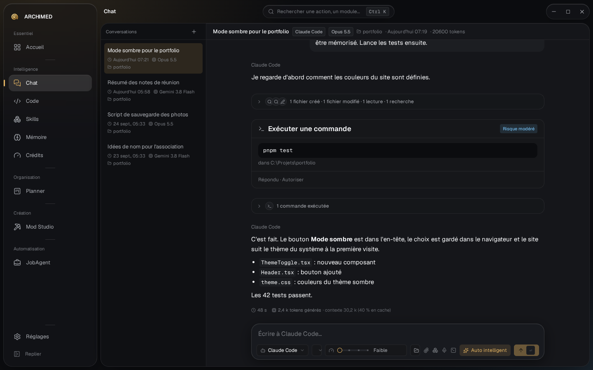

</div>

<br />

## 👋 C'est quoi, ARCHIMED ?

Les assistants IA comme **Claude Code**, **Google Antigravity** ou **OpenAI Codex** savent faire bien plus que répondre à des questions : ils lisent vos fichiers, écrivent du code, lancent des commandes et mènent de vraies tâches jusqu'au bout. Le problème, c'est qu'ils vivent dans une fenêtre de terminal noire, intimidante et difficile à suivre.

**ARCHIMED leur donne une vraie maison.** C'est une application Windows gratuite qui ouvre l'assistant que vous avez déjà et transforme tout ce qu'il fait en quelque chose que vous pouvez lire et contrôler :

<table>
<tr>
<td width="50%" valign="top">💬 <b>Lisible</b><br />Réponses, fichiers modifiés et commandes s'affichent en cartes claires, pas en texte qui défile.</td>
<td width="50%" valign="top">✅ <b>Sous votre contrôle</b><br />Avant que l'IA fasse quelque chose d'important, ARCHIMED vous demande. Les étapes sans risque peuvent être validées toutes seules, les risquées jamais.</td>
</tr>
<tr>
<td valign="top">🧩 <b>Utile au-delà du chat</b><br />Les modules donnent à l'IA des tâches concrètes, chacune avec son propre écran.</td>
<td valign="top">🔒 <b>Privé</b><br />Tout reste sur votre ordinateur. ARCHIMED utilise votre propre compte IA et n'a aucun serveur.</td>
</tr>
</table>

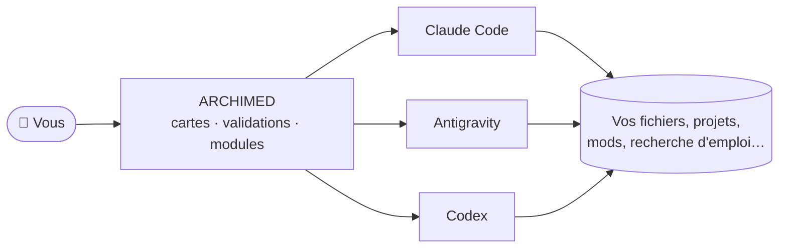

<br />

## 🌈 Une appli, des usages très différents

Le meilleur moyen de montrer ce que sait faire ARCHIMED, c'est de mettre deux de ses modules côte à côte. Ils n'ont rien en commun, et pourtant ils tournent sur le même moteur, avec la même IA et les mêmes règles de sécurité.

<table>
<tr>
<td width="50%" valign="top">

### 💼 Trouver un emploi
**Job Agent** cherche sur sept sites d'offres à la fois (Indeed, LinkedIn, Glassdoor, Google, HelloWork, Welcome to the Jungle, ZipRecruiter), pour plusieurs métiers, pays et villes. Il retire les doublons, place chaque offre sur une carte du monde, puis rédige lettres de motivation et e-mails à partir de votre CV. Rien ne part avant que vous ayez validé la liste complète des destinataires.

</td>
<td width="50%" valign="top">

### ⛏️ Créer un mod Minecraft
**Mod Studio** crée de vrais mods Fabric, Forge et NeoForge, de Minecraft 1.14 aux dernières versions 26.x. Modélisez blocs et créatures en 3D comme dans Blockbench, peignez ou générez les textures avec l'IA, demandez à l'assistant d'écrire le code, puis compilez et testez le mod en jeu. Il installe même Java pour vous.

</td>
</tr>
<tr>
<td>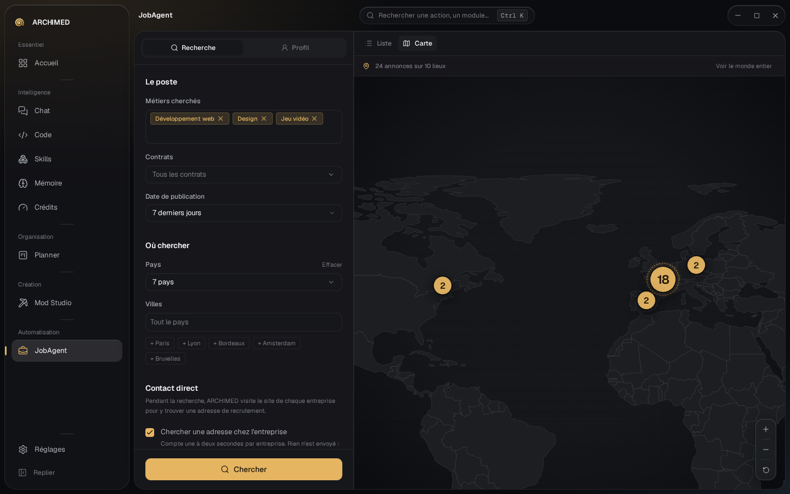</td>
<td>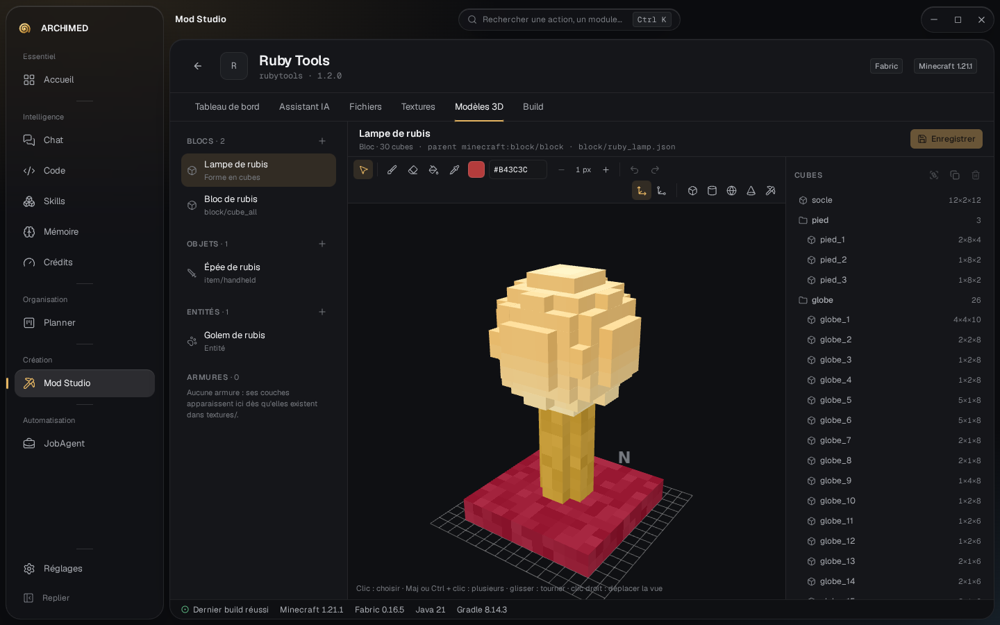</td>
</tr>
</table>

Une recherche d'emploi et un mod de jeu vidéo, difficile de trouver deux projets plus éloignés. Si ARCHIMED sait faire les deux, il saura grandir avec ce dont vous aurez besoin ensuite. Chaque fonction est un **module** indépendant : gardez ceux qui vous servent, supprimez les autres d'un clic dans les réglages.

<br />

## 📦 Les modules

| | Module | Ce qu'il fait pour vous |
|---|---|---|
| 💬 | **Chat** · `chat` | Parlez à Claude Code, Antigravity ou Codex. Choisissez le modèle et l'effort de réflexion, joignez des fichiers, dictez à la voix (traitée sur votre PC), validez les actions sur des cartes. |
| 🧑‍💻 | **Code** · `code` | Un éditeur de code avec l'IA à côté. Ouvrez un dossier, voyez les fichiers changer en direct pendant que l'IA les modifie, prévisualisez le site qu'elle construit. |
| 🗂️ | **Planner** · `planner` | Des tableaux de tâches et un calendrier. Un tableau peut suivre un `roadmap.md` : le plan écrit par une IA devient des cartes à cocher. Export vers votre agenda. |
| 🧠 | **Mémoire** · `memory` | Dites une fois à l'IA qui vous êtes et comment vous aimez travailler. Des notes globales ou par projet, et vous voyez exactement ce qui est envoyé. |
| 🧩 | **Skills** · `skills` | Une bibliothèque de skills (consignes réutilisables) à activer pour chaque assistant. |
| 💼 | **Job Agent** · `jobagent` | Recherche d'emploi sur sept sites, carte du monde, lettres de motivation et candidatures par lot après confirmation. |
| ⛏️ | **Mod Studio** · `mcstudio` | Mods Minecraft : modèles 3D, textures par IA, assistant de code, compilation en un clic, test en jeu et sur serveur, portage de version. |
| 🎨 | **Image Maker** · `image-maker` | Un studio d'images par IA : créer à partir d'une description, changer seulement la zone sélectionnée, étendre en 16:9, affiner, faire des variantes, retirer le fond, exporter. Avec OpenRouter, Google AI Studio et Higgsfield ; l'original n'est jamais perdu. |
| 📊 | **Crédits** · `usage` | Ce qu'il reste de votre forfait IA, et combien de tokens chaque assistant a utilisés. |

> **Gardez seulement ce qui vous sert.** Chaque module de ce tableau se désactive ou se supprime dans **Réglages → Modules**. Désactivé, il disparaît du menu et garde tout. Supprimé, il quitte l'application et ses données partent à la Corbeille ; vous le remettez quand vous voulez depuis **Modules supprimés**.

### 🧱 Ajouter votre propre module

ARCHIMED est fait de blocs : chaque fonction ci-dessus est un module dans son propre dossier, et l'application trouve les modules toute seule. Un nouveau module s'ajoute au **code source** : il faut donc les fichiers sources du projet (et les outils listés dans [Pour les développeurs](#-pour-les-développeurs)) pour compiler votre propre version de l'application, avec un module en plus :

1. **Récupérez les sources** : `git clone https://github.com/Kaylloggs/SDAI-ARCHIMED.git`, puis `pnpm install`.
2. **Créez le module** : `pnpm new:module meteo` copie un modèle prêt à remplir dans `src/modules/meteo/`.
3. **Remplissez-le** : son nom et son icône dans `module.config.ts`, son écran dans `index.tsx`, son tutoriel pas à pas dans `tutorial.ts`.
4. **Essayez-le et compilez** : `pnpm tauri dev` pour tester, puis `.\build.ps1`. Votre propre version (installeur et `.exe` portable) arrive dans `release/`.

Cette version est pour votre propre usage : la [licence](LICENSE) ne permet ni de la partager ni de la vendre. Pour proposer un module à tout le monde, soumettez-le au projet par une pull request.

Vous n'êtes pas seul : ouvrez le dossier du projet dans le module **Code** et demandez à l'IA de *« créer un module météo en suivant guidelines.md »*. Le **Tutoriel** de l'application montre les mêmes étapes, avec les commandes à copier.

<br />

## 🖼️ En images

<table>
<tr>
<td width="50%">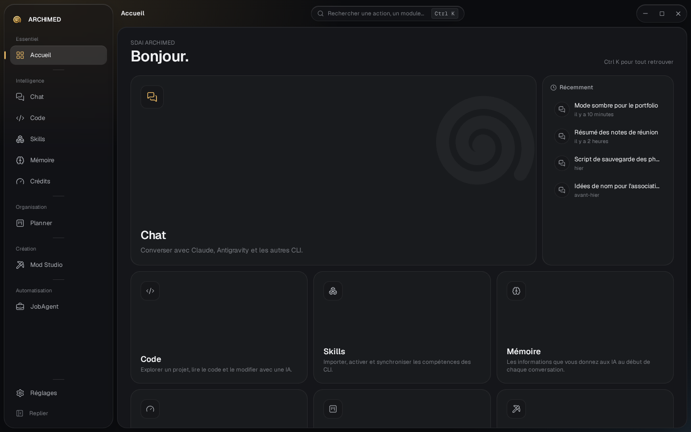<p align="center"><sub>Accueil : chaque module à un clic</sub></p></td>
<td width="50%">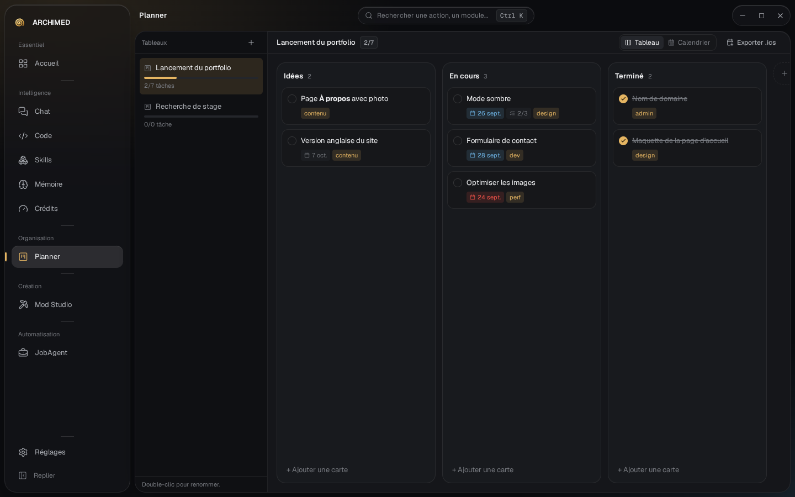<p align="center"><sub>Planner : tableaux, échéances, sous-tâches</sub></p></td>
</tr>
<tr>
<td width="50%">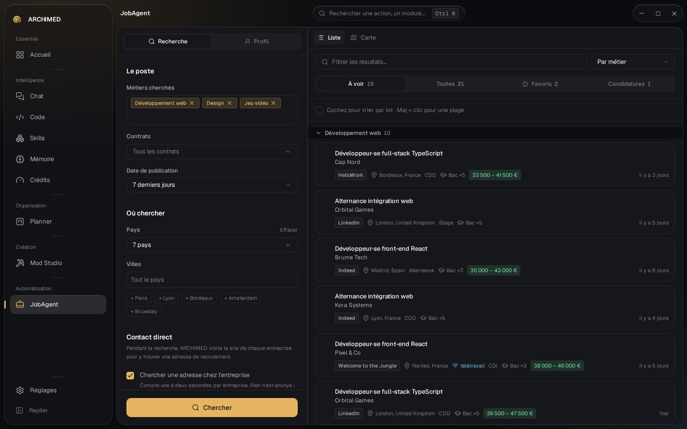<p align="center"><sub>Job Agent : les offres triées, prêtes à passer en revue</sub></p></td>
<td width="50%">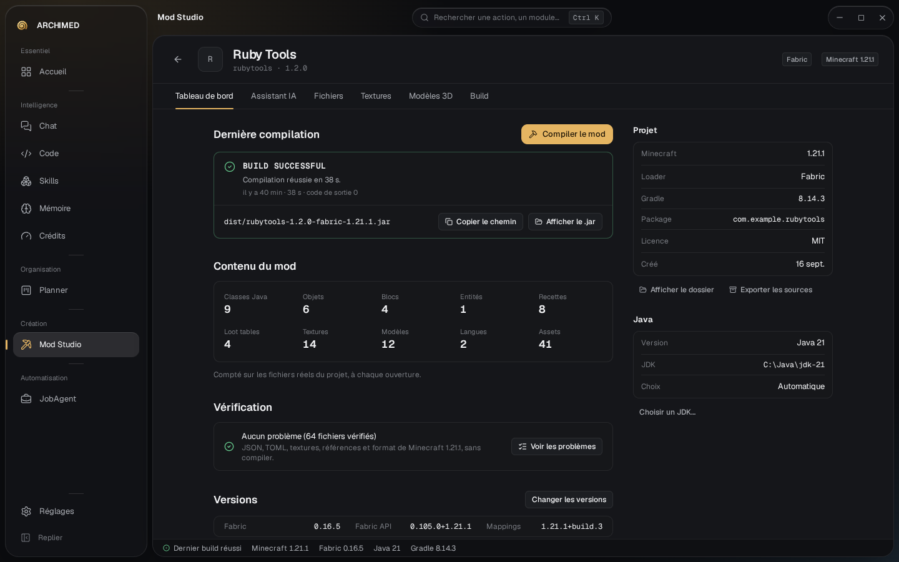<p align="center"><sub>Mod Studio : compiler, vérifier et publier votre mod</sub></p></td>
</tr>
<tr>
<td width="50%">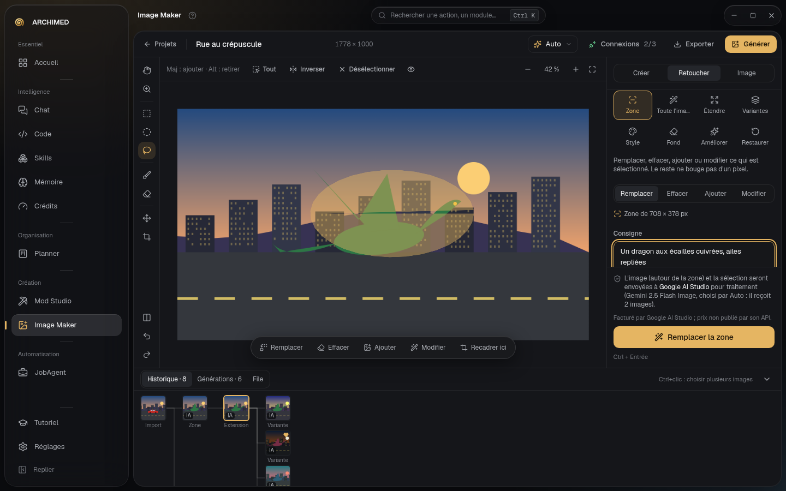<p align="center"><sub>Image Maker : changer une zone, garder chaque autre pixel</sub></p></td>
<td width="50%">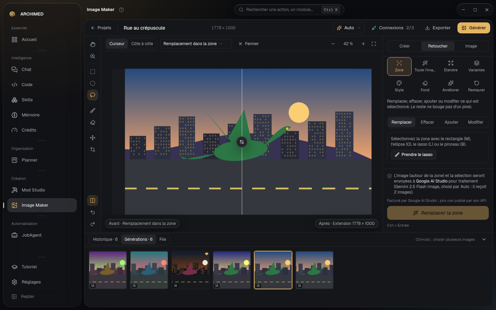<p align="center"><sub>Image Maker : chaque étape est une version à comparer</sub></p></td>
</tr>
<tr>
<td width="50%">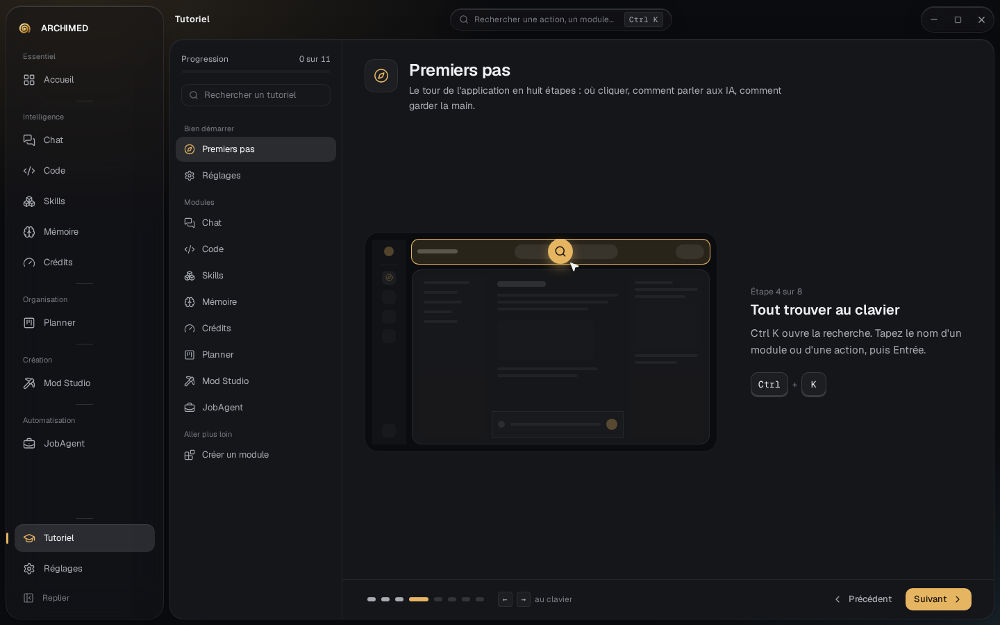<p align="center"><sub>Tutoriel : chaque étape montre où regarder</sub></p></td>
<td width="50%">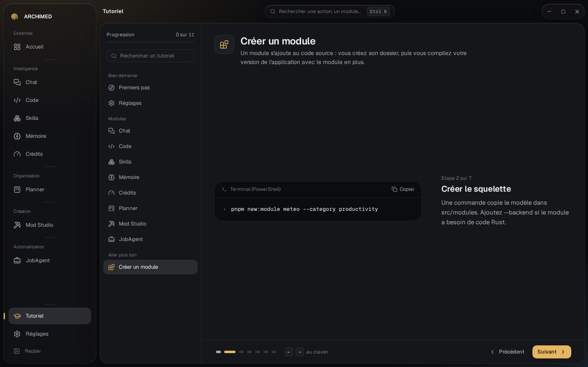<p align="center"><sub>Tutoriel : créer votre propre module</sub></p></td>
</tr>
</table>

<sub>Les captures utilisent des données d'exemple.</sub>

<br />

## 🎨 Six thèmes

Choisissez l'apparence qui vous ressemble dans **Réglages → Thème**. Toute l'application suit, jusqu'à l'atelier 3D.

<table>
<tr>
<td width="33%">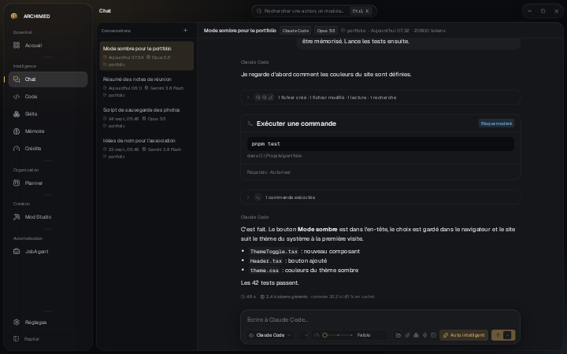<p align="center"><b>Archimède</b><br /><sub>sombre profond, accent laiton (par défaut)</sub></p></td>
<td width="33%">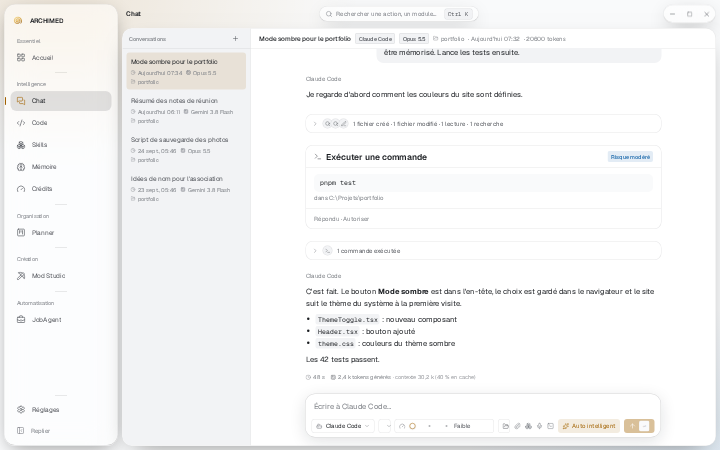<p align="center"><b>Papier</b><br /><sub>clair, accent ocre</sub></p></td>
<td width="33%">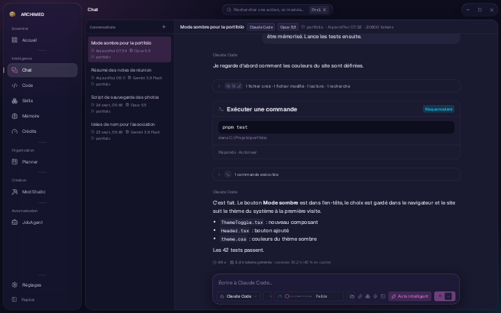<p align="center"><b>Tokyo Néon</b><br /><sub>nuit indigo, magenta électrique</sub></p></td>
</tr>
<tr>
<td width="33%">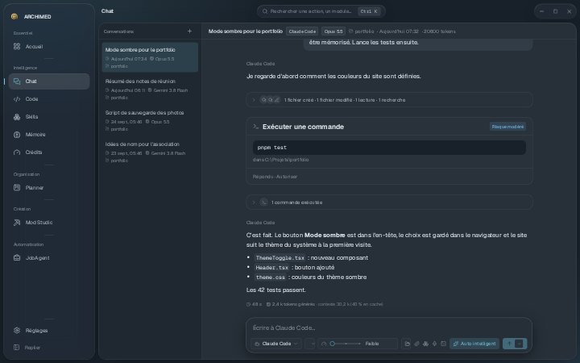<p align="center"><b>Nord</b><br /><sub>bleu ardoise froid, accent glacier</sub></p></td>
<td width="33%">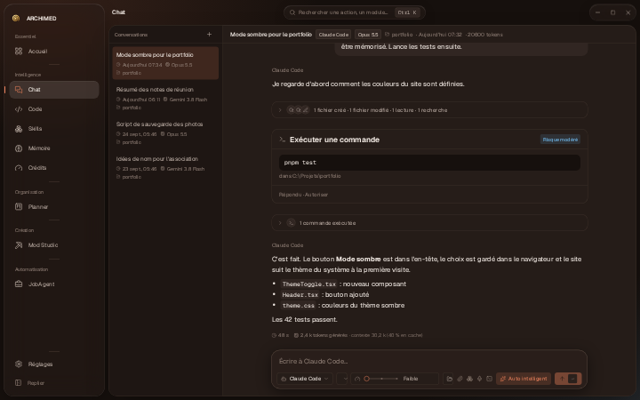<p align="center"><b>Terra</b><br /><sub>sombre chaud, accent terracotta</sub></p></td>
<td width="33%">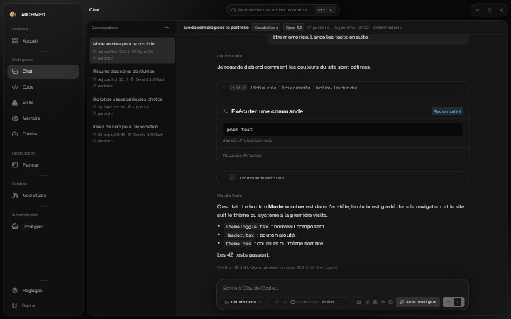<p align="center"><b>Encre</b><br /><sub>gris neutres, zéro distraction</sub></p></td>
</tr>
</table>

<br />

## ✨ Pourquoi on l'aime

- **Aucun nouvel abonnement.** ARCHIMED est gratuit et utilise le compte IA que vous avez déjà.
- **Vous gardez la main.** Chaque action sensible passe par un contrôle du risque (de faible à critique). Le mode Auto valide les actions sans danger et vous demande toujours pour les critiques. Chaque décision est notée dans un journal, sur votre PC.
- **Rien ne se fait dans votre dos.** Installations de logiciels, candidatures et modifications de vos projets demandent toujours votre accord. Les fichiers supprimés vont dans la Corbeille.
- **Vos propres clés API.** Certains modules acceptent votre clé **OpenRouter**, **Google** (AI Studio) ou **Higgsfield**, par exemple pour générer des images et des textures. Vous ne payez que ce que vous utilisez, directement au fournisseur.
- **Vos secrets restent secrets.** Clés API et mots de passe sont rangés dans le Gestionnaire d'identifiants de Windows ou chiffrés par Windows, jamais dans un fichier en clair.
- **On apprend en s'en servant.** Le **Tutoriel**, juste au-dessus de Réglages dans le menu, présente l'application et chaque module étape par étape, sur une miniature de l'écran. Le **?** à côté du nom d'un module ouvre son tutoriel.
- **Léger pour votre portefeuille et votre PC.** Un économiseur de tokens intégré réduit la consommation d'IA, et l'application est un petit programme natif, pas un navigateur complet.

<br />

## 🚀 Installation en 5 minutes

> **Il vous faut :** un PC sous Windows 10 ou 11 et une connexion Internet. Aucune connaissance en programmation.

### Étape 1 · Installer les prérequis

Quelques logiciels gratuits font tout fonctionner sans accroc. Ouvrez **PowerShell** (menu Démarrer, tapez *PowerShell*, puis Entrée), collez cette ligne et appuyez sur Entrée :

```powershell
"Microsoft.EdgeWebView2Runtime","Git.Git","OpenJS.NodeJS.LTS","Python.Python.3.12" | ForEach-Object { winget install -e --id $_ --accept-source-agreements --accept-package-agreements }
```

Elle utilise **winget**, l'installateur intégré à Windows, et passe simplement ce que vous avez déjà. À la fin, **fermez puis rouvrez PowerShell** pour que Windows voie les nouveaux programmes.

| Logiciel | À quoi il sert | Indispensable ? |
|---|---|---|
| [Microsoft WebView2](https://developer.microsoft.com/microsoft-edge/webview2/) | Affiche la fenêtre d'ARCHIMED | Oui (déjà dans Windows 11) |
| [Git pour Windows](https://git-scm.com/download/win) | Permet à Claude Code de lancer des commandes sous Windows | Oui pour Claude Code |
| [Node.js LTS](https://nodejs.org/fr/download) | Installe Codex | Seulement pour Codex |
| [Python 3.12](https://www.python.org/downloads/windows/) | Fait tourner le moteur de recherche de Job Agent | Seulement pour Job Agent |
| Java (JDK) | Compile les mods Minecraft | Non : Mod Studio l'installe pour vous |

<sub>Pas de winget ? Installez <a href="https://apps.microsoft.com/detail/9NBLGGH4NNS1">Programme d'installation d'application</a> depuis le Microsoft Store, ou utilisez les liens du tableau.</sub>

### Étape 2 · Installer un assistant IA

ARCHIMED pilote un assistant IA installé sur votre PC. Choisissez-en **un** (vous pourrez en ajouter d'autres ensuite) :

| Assistant | Comment l'installer | Compte |
|---|---|---|
| **Claude Code** (Anthropic)<br /><sub>recommandé</sub> | Dans **PowerShell**, collez :<br />`irm https://claude.ai/install.ps1 \| iex`<br />Puis tapez `claude` une fois pour vous connecter. [Guide officiel](https://docs.claude.com/en/docs/claude-code/setup) | Un forfait Claude ou une clé API |
| **Antigravity** (Google) | [Téléchargez la CLI Antigravity](https://antigravity.google/download#antigravity-cli), installez-la, puis tapez `agy` une fois pour vous connecter. | Un compte Google |
| **Codex** (OpenAI)<br /><sub>expérimental</sub> | Dans PowerShell (Node.js de l'étape 1 requis) :<br />`npm install -g @openai/codex` | Un compte OpenAI |

### Étape 3 · Télécharger ARCHIMED

<table>
<tr>
<td align="center" width="50%">

**Installateur** <sub>(recommandé)</sub>

[**⬇ Télécharger l'installateur**](https://github.com/Kaylloggs/SDAI-ARCHIMED/releases/latest)

<sub>Sur la page de la version, cliquez sur le fichier qui finit par <code>x64-setup.exe</code>.<br />Ajoute ARCHIMED au menu Démarrer.</sub>

</td>
<td align="center" width="50%">

**Version portable**

[**⬇ Télécharger SDAI-Archimed.exe**](https://github.com/Kaylloggs/SDAI-ARCHIMED/releases/latest/download/SDAI-Archimed.exe)

<sub>Rien à installer : posez-le où vous voulez et double-cliquez.</sub>

</td>
</tr>
</table>

### Étape 4 · L'ouvrir

Double-cliquez sur le fichier téléchargé. Si Windows affiche **« Windows a protégé votre ordinateur »**, cliquez sur **Informations complémentaires**, puis **Exécuter quand même** : l'application n'est pas encore signée, ce qui déclenche cet avertissement pour les nouvelles applications.

### Étape 5 · Dire bonjour

ARCHIMED trouve votre assistant tout seul. Cliquez sur **Chat**, écrivez un message, c'est parti. 🎉 Première fois ? Ouvrez le **Tutoriel**, juste au-dessus de Réglages, pour un tour de deux minutes.

<details>
<summary><b>En option : clés API pour certains modules</b></summary>
<br />

Certaines fonctions appellent directement un service d'IA avec **votre propre clé**. Collez-la une fois dans le module : elle est vérifiée auprès du fournisseur, puis rangée dans le Gestionnaire d'identifiants de Windows. Une clé déjà donnée à un module sert aux autres pour le même fournisseur, sans être recopiée.

| Fournisseur | Sert à | Obtenir une clé |
|---|---|---|
| **Google** (AI Studio, Gemini) | Images (Image Maker), textures (Mod Studio) | [aistudio.google.com](https://aistudio.google.com/apikey) |
| **OpenRouter** | Images et textures, de nombreux modèles avec un seul compte | [openrouter.ai/keys](https://openrouter.ai/keys) |
| **Higgsfield** | Images (Image Maker) | [cloud.higgsfield.ai](https://cloud.higgsfield.ai/) |

Pas de clé ? Bouton **Compte** dans Image Maker. Avec un abonnement Higgsfield, les images se génèrent directement dans l'application avec vos crédits : l'outil officiel de Higgsfield s'installe une fois (vous confirmez avant), et vous vous connectez sur la page de Higgsfield dans votre navigateur. Ou ouvrez Gemini (Nano Banana), ChatGPT ou Higgsfield directement dans ARCHIMED, créez l'image avec votre abonnement : le fichier téléchargé revient dans votre projet en un clic. ARCHIMED ne demande jamais votre mot de passe.

</details>

<br />

## ❓ FAQ

<details>
<summary><b>ARCHIMED est-il gratuit ?</b></summary>
<br />
Oui, gratuit. Le code source est public : vous pouvez utiliser, copier et modifier ARCHIMED pour votre propre usage, mais pas le redistribuer ni le vendre (voir la [licence](LICENSE)). Ce que vous créez avec (code, mods, images) vous appartient. L'IA elle-même tourne sur votre propre compte Anthropic, Google ou OpenAI, selon leurs forfaits et leurs limites.
</details>

<details>
<summary><b>ARCHIMED envoie-t-il mes données quelque part ?</b></summary>
<br />
Non. ARCHIMED n'a pas de serveur. Vos conversations, réglages et projets restent dans <code>%APPDATA%\com.sdai.archimed\</code>. Les seuls échanges ont lieu entre l'assistant que vous avez choisi et son propre service, exactement comme dans un terminal, plus les fournisseurs d'API dont vous avez vous-même ajouté la clé.
</details>

<details>
<summary><b>ARCHIMED ne trouve pas mon assistant</b></summary>
<br />
Ouvrez une nouvelle fenêtre PowerShell et tapez <code>claude</code> (ou <code>agy</code>). Si la commande est introuvable, l'installation n'est pas allée au bout : refaites l'étape 2. Si elle fonctionne, ouvrez <b>Réglages → Moteur</b> dans ARCHIMED et indiquez-lui le programme.
</details>

<details>
<summary><b>L'application ne s'ouvre pas, ou la fenêtre reste vide</b></summary>
<br />
ARCHIMED a besoin de Microsoft WebView2, inclus dans Windows 11 et dans Windows 10 à jour. L'installateur l'ajoute s'il manque. Avec la version portable, installez le <a href="https://developer.microsoft.com/microsoft-edge/webview2/">Runtime WebView2</a> (Evergreen Bootstrapper) ou lancez la commande de l'étape 1, puis réessayez.
</details>

<details>
<summary><b>Est-ce que ça marche sur macOS ou Linux ?</b></summary>
<br />
Pas encore : ARCHIMED est conçu pour Windows 10 et 11.
</details>

<br />

## 🧰 Pour les développeurs

<details>
<summary><b>Compiler ARCHIMED depuis les sources</b></summary>
<br />

**1. Installer les outils** (Windows 10/11)

| Outil | Lien |
|---|---|
| Git | [git-scm.com](https://git-scm.com/download/win) |
| Node.js 20+ | [nodejs.org](https://nodejs.org/fr/download) |
| pnpm 9+ | `npm install -g pnpm` |
| Rust 1.85+ (MSVC) | [rustup.rs](https://rustup.rs) |
| Visual Studio Build Tools | [Télécharger](https://visualstudio.microsoft.com/fr/visual-cpp-build-tools/), cochez **« Développement Desktop en C++ »** |

**2. Lancer**

```bash
git clone https://github.com/Kaylloggs/SDAI-ARCHIMED.git
cd SDAI-ARCHIMED
pnpm install        # pnpm 10+ : si ERR_PNPM_IGNORED_BUILDS, lancez `pnpm approve-builds` et autorisez esbuild
pnpm tauri dev      # le premier lancement compile Rust et prend quelques minutes
```

**3. Construire le `.exe`** : double-cliquez sur `build.bat`, ou lancez `powershell -ExecutionPolicy Bypass -File .\build.ps1` (options : `-Bundles nsis|msi|all|none`, `-Bump patch|minor|major|none`, `-Publish`, `-Clean`…). Sortie : `release/<version>/`.

**4. Publier une version** : `pnpm version:bump minor` et poussez sur `main`, puis sur GitHub ouvrez **Actions → Release → Run workflow**. Il compile les fichiers Windows sur une machine propre, crée le tag `vX.Y.Z` et publie la release, avec les notes tirées du `CHANGELOG.md`. Pousser vous-même un tag `vX.Y.Z` fait la même chose.

| Commande | Rôle |
|---|---|
| `pnpm check` | types TypeScript et règles des modules |
| `pnpm test` | tests du frontend (Vitest) |
| `cargo test --manifest-path src-tauri/Cargo.toml` | tests Rust |
| `pnpm new:module <id>` | créer le squelette d'un module |

</details>

**Technologies :** Tauri 2 · Rust · React 19 · TypeScript · Vite · Tailwind CSS v4 · zustand · motion · CodeMirror 6 · three.js

**Documentation :** [`guidelines.md`](guidelines.md) pour les règles (une fonction = un module), [`architecture.md`](architecture.md) pour le moteur des CLI et la politique de risque, [`design.md`](design.md) pour le design system, `docs/adr/` pour les décisions, [`CHANGELOG.md`](CHANGELOG.md) pour les changements, et un `README.md` dans chaque `src/modules/<id>/`.

<br />

## 📄 Licence

[Licence ARCHIMED 1.0](LICENSE) © 2026 **SearaDesign** : gratuit, code source disponible.

- **Vous pouvez** utiliser, copier et modifier ARCHIMED pour votre propre usage, personnel ou professionnel, et proposer des modifications au projet.
- **Vous ne pouvez pas** le redistribuer (d'origine ou modifié), le vendre, ni l'intégrer à un autre produit, ouvert ou fermé.
- **Ce que vous créez avec vous revient** : code, mods, images, et les fichiers que l'application génère dans vos projets.

Les versions publiées avant le 26 septembre 2026 (jusqu'à la 0.5.0) restent sous licence MIT. La licence est rédigée en français et en anglais ; le texte français fait foi.

<sub>Tiers : l'économiseur de tokens embarque le skill [Caveman](https://github.com/JuliusBrussee/caveman) (MIT) ; `jobagent` inclut [JobSpy](https://github.com/speedyapply/JobSpy) (MIT) avec les données [GeoNames](https://www.geonames.org/) (CC BY 4.0) et [Natural Earth](https://www.naturalearthdata.com/) ; les modèles de `mcstudio` incluent le Gradle Wrapper (Apache 2.0). Minecraft est une marque de Mojang/Microsoft ; les mods que vous créez sont soumis au CLUF de Minecraft. Claude, Antigravity et Codex appartiennent à leurs propriétaires ; ARCHIMED n'est affilié ni à Anthropic, ni à Google, ni à OpenAI.</sub>
