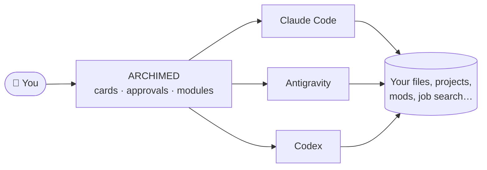

<div align="center">

**English** &nbsp;·&nbsp; [Français](README.fr.md)


# SDAI ARCHIMED

**Your AI assistant, finally at home on your desktop.**<br />
Chat with Claude, Gemini or Codex in a real app, approve what they do with one click,<br />
and put them to work: code, plan, search for a job, even build Minecraft mods.

[](https://github.com/Kaylloggs/SDAI-ARCHIMED/releases/latest)
[](#-install-in-5-minutes)
[](LICENSE)
[](#-for-developers)

### [⬇ Download for Windows](https://github.com/Kaylloggs/SDAI-ARCHIMED/releases/latest) &nbsp;·&nbsp; [Install guide](#-install-in-5-minutes) &nbsp;·&nbsp; [What's inside](#-whats-inside) &nbsp;·&nbsp; [FAQ](#-questions)


</div>

<br />

## 👋 What is ARCHIMED?

AI assistants such as **Claude Code**, **Google Antigravity** or **OpenAI Codex** can do far more than answer questions: they can read your files, write code, run commands and finish real tasks. The catch is that they live in a black terminal window, which is intimidating and hard to follow.

**ARCHIMED gives them a proper home.** It is a free Windows app that opens the assistant you already have and turns everything it does into something you can read and control:

<table>
<tr>
<td width="50%" valign="top">💬 <b>Readable</b><br />Answers, file changes and commands appear as clean cards, not scrolling text.</td>
<td width="50%" valign="top">✅ <b>Under your control</b><br />Before the AI does something that matters, ARCHIMED asks you. Harmless steps can be approved automatically, risky ones never are.</td>
</tr>
<tr>
<td valign="top">🧩 <b>Useful beyond chat</b><br />Modules give the AI concrete jobs to do, each with its own screen.</td>
<td valign="top">🔒 <b>Private</b><br />Everything stays on your computer. ARCHIMED uses your own AI account and has no server of its own.</td>
</tr>
</table>



<br />

## 🌈 One app, very different jobs

The best way to show what ARCHIMED can do is to put two of its modules side by side. They have nothing in common, and they run on the same engine, with the same AI and the same safety rules.

<table>
<tr>
<td width="50%" valign="top">

### 💼 Find a job
**Job Agent** searches seven job boards at once (Indeed, LinkedIn, Glassdoor, Google, HelloWork, Welcome to the Jungle, ZipRecruiter), across several job titles, countries and cities. It removes duplicates, shows every offer on a world map, then writes cover letters and emails from your CV. Nothing is sent until you confirm the full list of recipients.

</td>
<td width="50%" valign="top">

### ⛏️ Make a Minecraft mod
**Mod Studio** creates real mods for Fabric, Forge and NeoForge, from Minecraft 1.14 to 1.21. Model blocks and creatures in 3D like in Blockbench, paint or generate textures with AI, ask the assistant to write the code, then build and test the mod in the game. It even installs Java for you.

</td>
</tr>
<tr>
<td></td>
<td></td>
</tr>
</table>

A job hunt and a game mod are about as far apart as two projects can be. If ARCHIMED handles both, it can grow into whatever you need next. Every feature is an independent **module**: keep the ones you use, remove the others in one click from the settings.

<br />

## 📦 What's inside

| | Module | What it does for you |
|---|---|---|
| 💬 | **Chat** · `chat` | Talk to Claude Code, Antigravity or Codex. Pick the model and how hard it should think, attach files, dictate with your voice (processed on your PC), approve actions on cards. |
| 🧑‍💻 | **Code** · `code` | A code editor with the AI beside it. Open a folder, watch files update live as the AI edits them, preview the website it is building. |
| 🗂️ | **Planner** · `planner` | Task boards and a calendar. A board can follow a `roadmap.md`, so the plan an AI writes becomes cards you can tick off. Export to your calendar. |
| 🧠 | **Memory** · `memory` | Tell the AI once who you are and how you like to work. Notes can be global or per project, and you see exactly what is sent. |
| 🧩 | **Skills** · `skills` | A library of skills (reusable instructions) you can switch on for each assistant. |
| 💼 | **Job Agent** · `jobagent` | Job search on seven boards, world map, cover letters and batch applications after confirmation. |
| ⛏️ | **Mod Studio** · `mcstudio` | Minecraft mods: 3D models, AI textures, AI coding assistant, one-click build, game and server testing, version porting. |
| 📊 | **Usage** · `usage` | How much of your AI plan is left, and how many tokens each assistant used. |
| 🏠 | **Home** · `home` · **Settings** · `settings` | Your start page, and the place to choose the theme, the assistants and the modules. |

<br />

## 🖼️ A closer look

<table>
<tr>
<td width="50%"><p align="center"><sub>Home: every module one click away</sub></p></td>
<td width="50%"><p align="center"><sub>Planner: boards, due dates, subtasks</sub></p></td>
</tr>
<tr>
<td width="50%"><p align="center"><sub>Job Agent: offers sorted and ready to review</sub></p></td>
<td width="50%"><p align="center"><sub>Mod Studio: build, check and ship your mod</sub></p></td>
</tr>
</table>

<sub>The interface is in French for now. Screenshots use sample data.</sub>

<br />

## 🎨 Six themes

Pick the look that suits you in **Settings → Theme**. The whole app follows, down to the 3D studio.

<table>
<tr>
<td width="33%"><p align="center"><b>Archimède</b><br /><sub>deep dark, brass accent (default)</sub></p></td>
<td width="33%"><p align="center"><b>Papier</b><br /><sub>light, ochre accent</sub></p></td>
<td width="33%"><p align="center"><b>Tokyo Néon</b><br /><sub>indigo night, electric magenta</sub></p></td>
</tr>
<tr>
<td width="33%"><p align="center"><b>Nord</b><br /><sub>cold slate blue, ice accent</sub></p></td>
<td width="33%"><p align="center"><b>Terra</b><br /><sub>warm dark, terracotta accent</sub></p></td>
<td width="33%"><p align="center"><b>Encre</b><br /><sub>neutral greys, zero distraction</sub></p></td>
</tr>
</table>

<br />

## ✨ Why people like it

- **No new subscription.** ARCHIMED is free and uses the AI account you already have.
- **You stay in charge.** Every sensitive action goes through a risk check (low to critical). Auto mode approves the harmless ones and always asks for the critical ones. Every decision is written to a log on your PC.
- **Nothing happens behind your back.** Software installs, job applications and changes to your projects always ask first. Deleted files go to the Recycle Bin.
- **Bring your own API keys.** Some modules can use your own key from **OpenRouter**, **Google** (AI Studio) or **Higgsfield**, for example to generate images and textures. You only pay for what you use, directly to the provider.
- **Secrets stay secret.** API keys and passwords are kept in the Windows Credential Manager or encrypted by Windows, never in a plain file.
- **Light on your wallet and your PC.** A built-in token saver cuts AI usage, and the app is a small native program, not a full browser.

<br />

## 🚀 Install in 5 minutes

> **You need:** a Windows 10 or 11 PC and an internet connection. No coding knowledge required.

### Step 1 · Install the prerequisites

A few free programs make everything work smoothly. Open **PowerShell** (Start menu, type *PowerShell*, press Enter), paste this line and press Enter:

```powershell
"Microsoft.EdgeWebView2Runtime","Git.Git","OpenJS.NodeJS.LTS","Python.Python.3.12" | ForEach-Object { winget install -e --id $_ --accept-source-agreements --accept-package-agreements }
```

It uses **winget**, the installer built into Windows, and simply skips what you already have. When it is done, **close and reopen PowerShell** so Windows sees the new programs.

| Program | What it is for | Needed? |
|---|---|---|
| [Microsoft WebView2](https://developer.microsoft.com/microsoft-edge/webview2/) | Displays the ARCHIMED window | Yes (already in Windows 11) |
| [Git for Windows](https://git-scm.com/download/win) | Lets Claude Code run commands on Windows | Yes for Claude Code |
| [Node.js LTS](https://nodejs.org/en/download) | Installs Codex | Only for Codex |
| [Python 3.12](https://www.python.org/downloads/windows/) | Runs the Job Agent search engine | Only for Job Agent |
| Java (JDK) | Builds Minecraft mods | No: Mod Studio installs it for you |

<sub>No winget? Install <a href="https://apps.microsoft.com/detail/9NBLGGH4NNS1">App Installer</a> from the Microsoft Store, or use the links in the table.</sub>

### Step 2 · Install an AI assistant

ARCHIMED drives an AI assistant installed on your PC. Pick **one** (you can add others later):

| Assistant | How to install | Account |
|---|---|---|
| **Claude Code** (Anthropic)<br /><sub>recommended</sub> | In **PowerShell**, paste:<br />`irm https://claude.ai/install.ps1 \| iex`<br />Then type `claude` once to sign in. [Official guide](https://docs.claude.com/en/docs/claude-code/setup) | A Claude plan or an API key |
| **Antigravity** (Google) | [Download the Antigravity CLI](https://antigravity.google/download#antigravity-cli), install it, then type `agy` once to sign in. | A Google account |
| **Codex** (OpenAI)<br /><sub>experimental</sub> | In PowerShell (Node.js from step 1 needed):<br />`npm install -g @openai/codex` | An OpenAI account |

### Step 3 · Download ARCHIMED

<table>
<tr>
<td align="center" width="50%">

**Installer** <sub>(recommended)</sub>

[**⬇ Download the setup file**](https://github.com/Kaylloggs/SDAI-ARCHIMED/releases/latest)

<sub>On the release page, click the file ending in <code>x64-setup.exe</code>.<br />Adds ARCHIMED to the Start menu.</sub>

</td>
<td align="center" width="50%">

**Portable version**

[**⬇ Download SDAI-Archimed.exe**](https://github.com/Kaylloggs/SDAI-ARCHIMED/releases/latest/download/SDAI-Archimed.exe)

<sub>Nothing to install: put it anywhere and double-click it.</sub>

</td>
</tr>
</table>

### Step 4 · Open it

Double-click the file you downloaded. If Windows shows **“Windows protected your PC”**, click **More info**, then **Run anyway**: the app is not code-signed yet, which triggers this warning for new apps.

### Step 5 · Say hello

ARCHIMED finds your assistant on its own. Click **Chat**, type a message, and you are set. 🎉

<details>
<summary><b>Optional: API keys for some modules</b></summary>
<br />

Some features call an AI service directly with **your own key**. Paste it once in the module: it is stored in the Windows Credential Manager.

| Provider | Used for | Get a key |
|---|---|---|
| **Google** (AI Studio, Gemini) | Images and textures | [aistudio.google.com](https://aistudio.google.com/apikey) |
| **OpenRouter** | Images and textures, many models in one account | [openrouter.ai/keys](https://openrouter.ai/keys) |
| **Higgsfield** | Images and videos | [higgsfield.ai](https://higgsfield.ai) |

</details>

<br />

## ❓ Questions

<details>
<summary><b>Is ARCHIMED free?</b></summary>
<br />
Yes, free and open source (MIT). The AI itself runs on your own account with Anthropic, Google or OpenAI, under their plans and limits.
</details>

<details>
<summary><b>Does ARCHIMED send my data anywhere?</b></summary>
<br />
No. ARCHIMED has no server. Your conversations, settings and projects stay in <code>%APPDATA%\com.sdai.archimed\</code>. The only traffic is between the assistant you chose and its own service, exactly as when you use it in a terminal, plus the API providers whose key you added yourself.
</details>

<details>
<summary><b>ARCHIMED says it cannot find my assistant</b></summary>
<br />
Open a new PowerShell window and type <code>claude</code> (or <code>agy</code>). If the command is not found, the install did not finish: repeat step 2. If it works there, open <b>Settings → Engine</b> in ARCHIMED and point it to the program.
</details>

<details>
<summary><b>The app does not open, or the window stays blank</b></summary>
<br />
ARCHIMED needs Microsoft WebView2, included in Windows 11 and in up-to-date Windows 10. The installer adds it when missing. With the portable version, install the <a href="https://developer.microsoft.com/microsoft-edge/webview2/">WebView2 Runtime</a> (Evergreen Bootstrapper) or run the step 1 command, then try again.
</details>

<details>
<summary><b>Does it work on macOS or Linux?</b></summary>
<br />
Not yet: ARCHIMED is built for Windows 10 and 11.
</details>

<br />

## 🧰 For developers

<details>
<summary><b>Build ARCHIMED from source</b></summary>
<br />

**1. Install the tools** (Windows 10/11)

| Tool | Link |
|---|---|
| Git | [git-scm.com](https://git-scm.com/download/win) |
| Node.js 20+ | [nodejs.org](https://nodejs.org/en/download) |
| pnpm 9+ | `npm install -g pnpm` |
| Rust 1.85+ (MSVC) | [rustup.rs](https://rustup.rs) |
| Visual Studio Build Tools | [Download](https://visualstudio.microsoft.com/visual-cpp-build-tools/), tick **“Desktop development with C++”** |

**2. Run it**

```bash
git clone https://github.com/Kaylloggs/SDAI-ARCHIMED.git
cd SDAI-ARCHIMED
pnpm install        # pnpm 10+: if ERR_PNPM_IGNORED_BUILDS, run `pnpm approve-builds` and allow esbuild
pnpm tauri dev      # the first launch compiles Rust and takes a few minutes
```

**3. Build the `.exe`**: double-click `build.bat`, or run `powershell -ExecutionPolicy Bypass -File .\build.ps1` (options: `-Bundles nsis|msi|all|none`, `-Bump patch|minor|major|none`, `-Publish`, `-Clean`…). Output: `release/<version>/`.

**4. Publish a release**: `pnpm version:bump minor`, commit, then push a tag `vX.Y.Z`. GitHub Actions builds the Windows files on a clean machine and publishes the release, with the notes taken from `CHANGELOG.md`.

| Command | Purpose |
|---|---|
| `pnpm check` | TypeScript types and module rules |
| `pnpm test` | frontend tests (Vitest) |
| `cargo test --manifest-path src-tauri/Cargo.toml` | Rust tests |
| `pnpm new:module <id>` | scaffold a new module |

</details>

**Stack:** Tauri 2 · Rust · React 19 · TypeScript · Vite · Tailwind CSS v4 · zustand · motion · CodeMirror 6 · three.js

**Docs** (in French): [`guidelines.md`](guidelines.md) for the rules (one feature = one module), [`architecture.md`](architecture.md) for the CLI engine and the risk policy, [`design.md`](design.md) for the design system, `docs/adr/` for decisions, [`CHANGELOG.md`](CHANGELOG.md) for changes, and a `README.md` in each `src/modules/<id>/`.

<br />

## 📄 License

[MIT](LICENSE) © 2026 **SearaDesign**

<sub>Third-party: the token saver bundles the [Caveman](https://github.com/JuliusBrussee/caveman) skill (MIT); `jobagent` vendors [JobSpy](https://github.com/speedyapply/JobSpy) (MIT) with [GeoNames](https://www.geonames.org/) (CC BY 4.0) and [Natural Earth](https://www.naturalearthdata.com/) data; `mcstudio` templates ship the Gradle Wrapper (Apache 2.0). Minecraft is a trademark of Mojang/Microsoft; mods you build are subject to the Minecraft EULA. Claude, Antigravity and Codex belong to their owners; ARCHIMED is not affiliated with Anthropic, Google or OpenAI.</sub>
